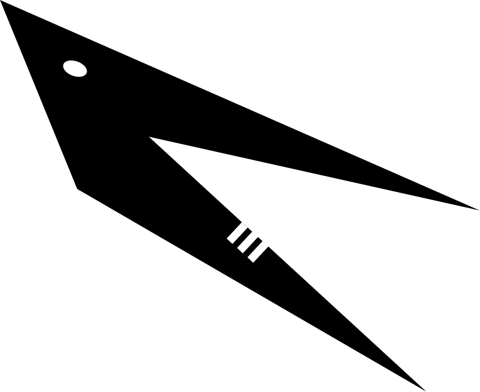

<h1 align="center">
    
</h1>

<h4 align="center">
    Feature complete OP Stack as an execution extension.
</h4>

  
  
  

  <a href="#whats-cabrinha">What's Cabrinha?</a> •
  <a href="#status">Status</a> •
  <a href="#getting-started">Getting Started</a> •
  <a href="https://refcell.github.io/cabrinha/CONTRIBUTING.html">Contributing</a> •
  <a href="#credits">Credits</a>

## What's Cabrinha?

_`cabrinha`: little goat_

Cabrinha is a suite of extensible [OP Stack][op-stack] components.

Built on top of these components, [`goat`][goat] is an [execution extension][exex] that runs the [OP Stack][op-stack] as a single executable process.

## Status

`cabrinha` is currently in active development, and is not yet ready for use in production.

## Getting Started

OP Stack components are individually defined in [crates](./crates/).

The execution extension (`goat`) provides an executable that can be run with `just goat` (using [Just][j]).

To learn more, see the [book][book].

## Book

The [book][book] contains a more in-depth overview of the project, contributor guidelines, tutorials for composing you own OP Stack with custom components.

## Credits

`cabrinha` is inspired by the work of several teams, namely [OP Labs][op-labs] and other contributors' work on [`kona`][kona].

[j]: https://github.com/casey/just
[exex]: https://www.paradigm.xyz/2024/05/reth-exex
[goat]: ./bin/goat/
[kona]: https://github.com/ethereum-optimism/kona
[op-stack]: https://github.com/ethereum-optimism/optimism
[book]: https://refcell.github.io/cabrinha
[op-labs]: https://github.com/ethereum-optimism
