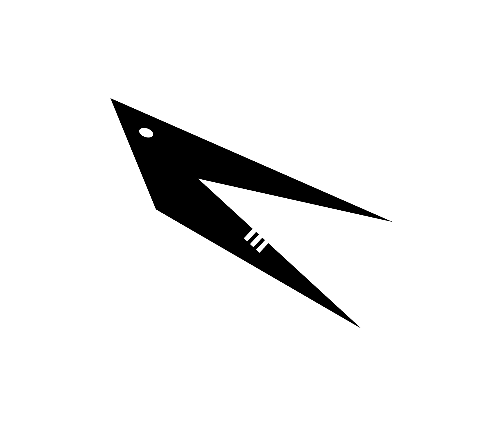

<h1 align="center">
    
</h1>

<h4 align="center">
    Feature complete OP Stack as an execution extension.
</h4>

  
  
  

  <a href="#whats-cabrinha">What's Cabrinha?</a> •
  <a href="#development-status">Development Status</a> •
  <a href="https://refcell.github.io/cabrinha/CONTRIBUTING.html">Contributing</a> •
  <a href="#credits">Credits</a>

## What's Cabrinha?

Cabrinha is a suite of extensible components of the [OP Stack][op-stack].

Built on top of these components, the [execution extension][exex] offers an executable that runs the full [OP Stack][op-stack] as a singular process.

## Development Status

`cabrinha` is currently in active development, and is not yet ready for use in production.

## Book

The [book][book] contains a more in-depth overview of the project, contributor guidelines, tutorials for getting started with building your own OP Stack components.

## Credits

`cabrinha` is inspired by the work of several teams, namely [OP Labs][op-labs] and other contributors' work on [`kona`][kona].

[kona]: https://github.com/ethereum-optimism/kona
[op-stack]: https://github.com/ethereum-optimism/optimism
[book]: https://refcell.github.io/cabrinha
[op-labs]: https://github.com/ethereum-optimism
